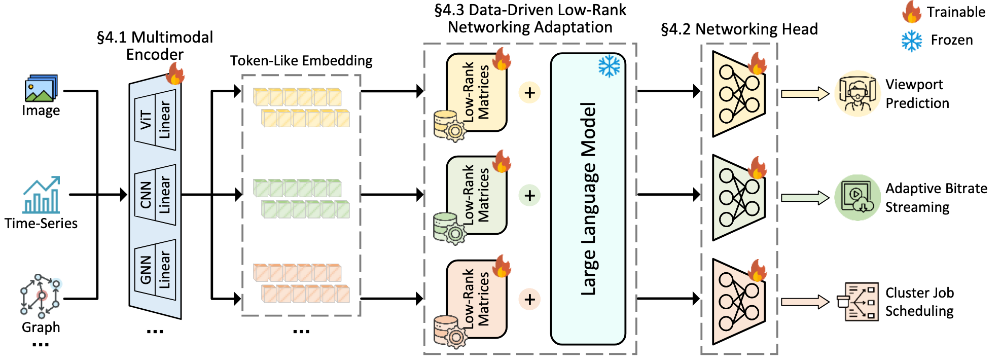

## Review for "NetLLM: Adapting Large Language Models for Networking"

Yuchen You (yuchenxr) & Aug 31, 2025

### Motivation & goal

- What problem is this work addressing?
  - This work is addressing the problem of adapting large language models (LLMs) for networking tasks.
- Why the problem is important?
  - Because current design philosophy with DL requires a lot of engineering overhead with poor generalization performance on unseen data.
- What goals does this work aim to achieve?
  - This work aims to use LLMs for better networking adaptation for a better performance and stronger generalization.

### Related work

- What are the state-of-the-art solutions addressing this problem?

  - Rule-based approaches
    - Copa for congestion control
    - PANDA for heuristically estimated bandwidth
  - Learning-based approaches
    - SL for traffic classification and bandwidth prediction
    - RL for congestion control, ABR, and CJS

- Why they are inadequate?

  - Rule-based: Heavily rely on rule engineering, which involves intensive human efforts
  - Learning-based:
    1. High model engineering cost: the algorithms may only be useful in specific scenarios (_one model for one task_)
    2. Low generalization performance: the models may not perform well on unseen data, limiting their applicability.

### Idea & insight

- What is the key idea of this work?
  - Adapt LLMs for the networking domain to improve performance and generalization, namely design _one model for all tasks_.
- What is the insight, if any, behind this idea?
  - Researchers have shown that LLMs can generate goal-oriented plans for robotic control, adjusting plans in response to environment changes, and generalize to previously unseen operating environments
- Why _might_ this idea be better than prior work?
  - LLMs are good at few shot learning, which could help them to solve unseen problems and are thus quite flexible, which is far better than prior DNN designs.

### Solution

- Roughly speaking, how does the solution work?
  - Multimodal encoder: enable LLM to process multimodal data in networking.
  - Networking head: improve the efficiency of answer generation.
  - DD-LRNA (Data-Driven Low Rank Networking Adaptation): efficiently acquire domain knowledge for networking. Incorporates a data-driven adaptation pipeline to adapt the LLM for both prediction and decision-making tasks.
- What are the key techniques and algorithms used in the solution?
  - LLM fine-tuning
  - Low-rank adaptation

### Assumption & limitations

- What assumptions do the proposed solution make?
  - Utilizing the Domain-Adapted LLMs for networking tasks will lead to better performance and generalization.
- Are these assumptions reasonable? Are there any assumption that the authors did not describe in the paper?
  - Yes. The assumptions are reasonable, since recent years we have seen a lot of successful examples of domain adaptation in various fields.
- What limitations does this solution have?
  - Multimodal still limits the input types to mainly video and autio data.

### Effectiveness

- What experiments, analyses are conducted to evaluate the solution?
  - Setup: use Llama2-7B as the foundation LLM, and the tasks are VP, ABR and CJS.
  - Baselines: 3 SOTA learning based algo: TRACK for VP, GENET for ABR, and Decima for CJS.
  - Metrics: MAE for VP, QoE for ABR, JCT for CJS. Test on unseen data.
  - Hardware: Linux, 8 Intel Xeon Gold 5318Y CPUs and two NVIDIA 40GB A100 GPUs
- Do these results and analyses back up the paper's claims?
  - Result: NetLLM-adapted Llama2 consistently outperforms other methods across all cases
  - Enabled by NetLLM, Llama2 demonstrates superior generalization performance.
- Are there any missing aspects in the evaluation?

### Comparison

- How does this work compare with some other works we have read/discussed?
  - Yes, it compares the model with existing rule-based and learning-based approaches in the performance of field-specific tasks.
  - Also it compares with other models, same model with different size of LLM, and on real world environments. This shows the model needs at least 1B parameters to perform well, and the Llama2 model is a good choice since it outperforms many other LLMs.
- Does it take a radically different approach or draw a surprising conclusion?
  - It combines the LLMs to the networking issue solving, which is a breaking change.
- Or is it more or less in line with the direction in the other works?
  - It is in line with the effectiveness of using LLMs for specialized tasks in all kinds of domains.

### Learning & thoughts

- Are you convinced that the proposed idea/solution is good?
  - Yes. The paper shows enough evidence that it will work well in practice, at least in 3 different network related tasks
- If not, what flaws you see in the work that can be improved?
  - N/A
- What are the new things you learned from this paper?
  - In modern research, combining LLMs/agents in the networking domain is a promising direction.

### Unanswered questions

- What questions are you left with?
  - Are there any potential ethical concerns, or downsides to using LLMs in networking? Like some potential dangers of misuse or unintended consequences.
- Are there any confusing parts of the paper that are not addressed?
  - N/A
- If you were the authors, is there anything you would do differently?
  - Add a robustness experiment to test the reliability of the model.

### Conclusion

- What conclusion do you draw from this work?
  - for the first time the authors explore the utilization of LLMs as foundation models for networking to reduce handcraft costs involved in algorithm design and achieve strong generalization.
- What are the main take-away messages?
  - LLMs are promising tools for addressing many engineering challenges in networking (maybe also OS).
- Can you relate to the findings/solutions/results from your own experience?
  - Yes, I have seen similar approaches in other domains like OS where LLMs are used to automate and optimize complex tasks or solve complex problems.
- How may this work influence the way we build systems in the future?
  - Further research and development could lead to more robust and efficient networking solutions powered by LLMs with more modern techniques like the reasoning.
